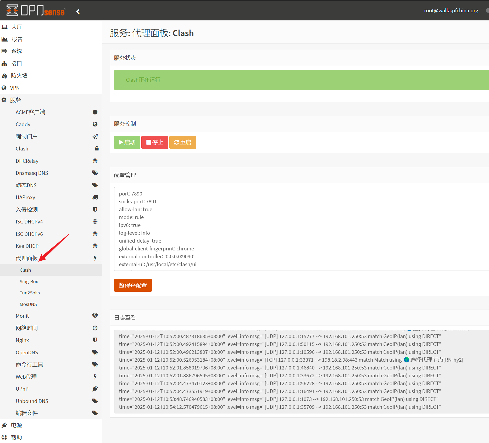
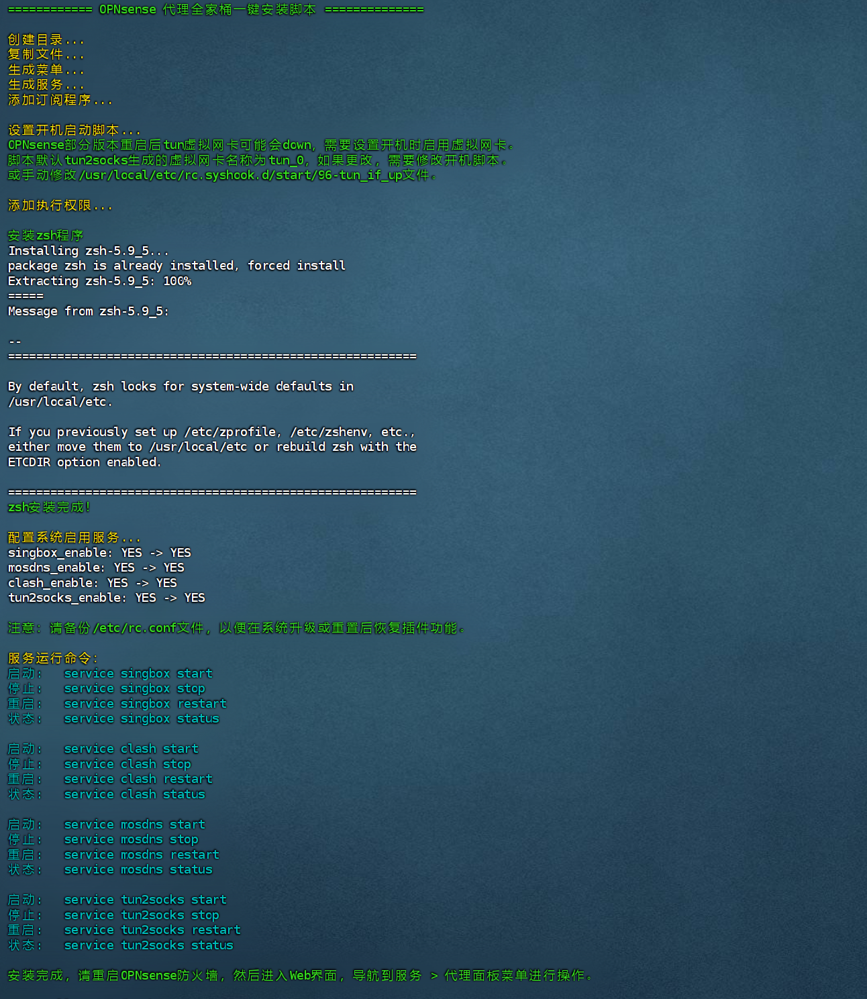

# Clash for OPNsense 代理全家桶
OPNSense上运行clash、sing-box、tun2socks、mosdns的一键安装程序。支持clash订阅转换，支持透明代理，支持DNS分流。带Web控制程序，可以进行配置修改、程序控制、日志查看等。OPNsense 24.7.11测试通过。


# 项目来源
基于以下程序整合：

[clash（mihomo）](https://github.com/MetaCubeX/mihomo/releases)/
[sin-box](https://github.com/SagerNet/sing-box)/
[tun2socks](https://github.com/xjasonlyu/tun2socks)/ 
[mosdns](https://github.com/IrineSistiana/mosdns)/
[yacd](https://github.com/haishanh/yacd)/
[subconverter](https://github.com/tindy2013/subconverter)

# 使用须知
1、 脚本不提供任何订阅信息，示例配置仅供参考。

2、 使用订阅功能前请手动更改`env`文件中的`CLASH_URL`变量值，否则无法正常运行。

3、 支持x86_64平台。

# 安装程序
下载压缩包并解压，上传到防火墙，进入目录，运行以下命令：

```bash
sh install.sh
```
如下图所示：


# 使用方法
请参考以下文章：

[OPNsense代理全家桶安装配置教程](https://pfchina.org/?p=14148)

# 常见问题

订阅转换如果无法使用，可以通过[sublinkx](https://github.com/gooaclok819/sublinkX)自建平台对订阅地址进行转换。

# 相关文章

[pfSense、OPNsense配置Xray代理教程](https://pfchina.org/?p=13013)

[pfSense、OPNsense配置trojan-go教程](https://pfchina.org/?p=9885)

[pfSense、OPNsense配置v2ray代理教程](https://pfchina.org/?p=4032)

[pfSense、OPNsense配置Clash代理教程](https://pfchina.org/?p=10526)

[pfSense、OPNsense配置hysteria代理教程](https://pfchina.org/?p=9524)

[pfSense、OPNsense设置http透明代理教程](https://pfchina.org/?p=13572)

[pfSense、OPNsense配置sing-box代理教程](https://pfchina.org/?p=12933)

[pfSense、OPNsense配置http透明代理教程](https://pfchina.org/?p=13572)

[pfSense、OPNsense配置hysteria2代理教程](https://pfchina.org/?p=13065)

[pfSense、OPNsense配置tun2socks透明代理](https://pfchina.org/?p=13437)

[pfSense、OPNsense配置tun2socks透明代理教程](https://pfchina.org/?p=13437)

[pfSense、OPNsense配置hysteria(TUN) 透明代理教程](https://pfchina.org/?p=13480)
